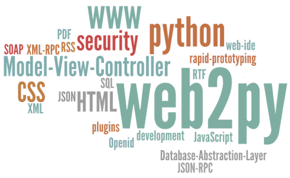

Title: Introdução ao web2py
Date: 2015-05-04 00:00  
Category: web2py
Tags: web2py, iniciantes
Slug: introducao-ao-web2py 
Author: Cássio Botaro  
Summary: Uma breve introdução prática ao framework web2py e uma lista de recursos interessantes.


##Sobre o web2py

Framework full-stack(ou seja assim como python vem com baterias incluídas), para desenvolvimento rápido, seguro, portável e orientado a banco de dados(o que não o limita).

O download pode ser feito através da página [http://www.web2py.com/](http://www.web2py.com/download) e quando este artigo foi escrito estava em sua versão 2.10.X.

Embora possua versões para Windows e MAC eu recomendo sempre baixar a versão de código fonte.

##Hello Web2py(Talk is cheap. Show me the code)

Iniciaremos criando uma aplicação mínima no web2py(sem utilizar sua interface ou um scaffolding).

Navegue até o diretório applications do web2py, crie um diretório com o nome da sua aplicação(Eu chamerei o exemplo de hello).

Dentro deste diretório inclua um diretório chamado controllers.

Em seguida crie um arquivo chamado default.py no diretório controllers e digite o seguinte código.

```python
def index():
    return 'Hello World'
```

Vá no diretório raiz do web2py, rode o arquivo web2py.py e pronto!
Para acessar sua aplicação utilize a seguinte url: http://127.0.0.1:8000/hello

Duas observações devem ser feitas neste ponto, caso navegue no diretório da sua aplicação vai notar que outros diretórios foram criados(nao se reocupe com eles por enquanto). Outra coisa é o nome do arquivo python(default) e a função(index). Isto é um padrão e pode ser modificado utilizando um arquivo de rotas.

Todo o processo acima pode ser resumido da seguinte maneira(à partir da raiz do diretório web2py):
```bash
mkdir applications/hello # criação da aplicação
mkdir applications/hello/controllers # criação da pasta controllers
echo "def index():" > applications/hello/controllers/default.py
echo "    return 'Hello World'" >> applications/hello/controllers/default.py
```



##Hello Author

Vamos tornar nosso primeiro aplicativo web mais interessante, vamos faze-lo passar a exibir um nome recebido como argumento em nossa url.

Abra novamente o controlador default.py e agora adicione o seguinte código:
```python
def index():
    nome = request.args(0)
    return {'nome': nome}
```
 
 O código agora foi alterado, para incialmente receber uma variável chamada nome que contém o valor do argumento 0.

 Argumento 0, wtf? 

 Uma url pode ser decomposta assim no web2py:
    http://host/application/controller/action/args1/args2...?var1=valor&var2=valor

    - host - Domínio ou subdominio da sua aplicação(Pode ser www.algo.com ou localmente localhost:8000 sendo 8000 porta padrão do servidor web2py)
    - application - nome da sua aplicação
    - controller - nome do controlador
    - action - nome da função presente no controlador
    - args - argumentos(como parâmetros)
    - vars - são como variáveis e sempre tem um nome e um valor

O retorno que anteriormente era um string, agora é um dicionário, este dicionário são as variáveis que estarão disponíveis na template para o contexto desta ação.

Agora crie um diretório default na pasta views e em seguida adicione um arquivo chamado index.html dentro deste diretório.

Neste arquivo adicione o seguinte conteúdo:
```html
<!DOCTYPE html>
<html lang="pt-br">
<head>
    <meta charset="UTF-8">
    <title>Hello</title>
</head>
<body>
    <h1>Hello {{=nome}}</h1>
</body>
</html>
```

Repare que este arquivo é um arquivo html comum, porém na Ttag H1 eu utilizo da linguagem de template do web2py para adicionar um recurso dinamicamente ao html.

`{{}}` é a maneira da template do web2py reconhecer que ali código será executado antes de retornar uma resposta ao cliente. O igual indica que uma expressão deve ser avaliada, no caso do exemplo uma variável será adicionada.
Como pode ser visto a variável nome que foi definida para o ambiente desta action(default/index) está disponível em minha template.

Agora acesse http://localhost:8000/hello/default/index/cassio ou substitua cassio por algo que queira e veja o resultado.

## Considerações finais
Este foi o primeiro post sobre web2py do meu blog, quis ser breve. Se ficou perdido em algum detalhe, não se preocupe, deixe um comentário que adorarei lhe ajudar.

E já adiantando, teremos continuação para este post, demonstrando diversos recursos do framework e também dscutindo sobre suas "mágicas".

Gostou? Compatilhe!

[ ]'s


