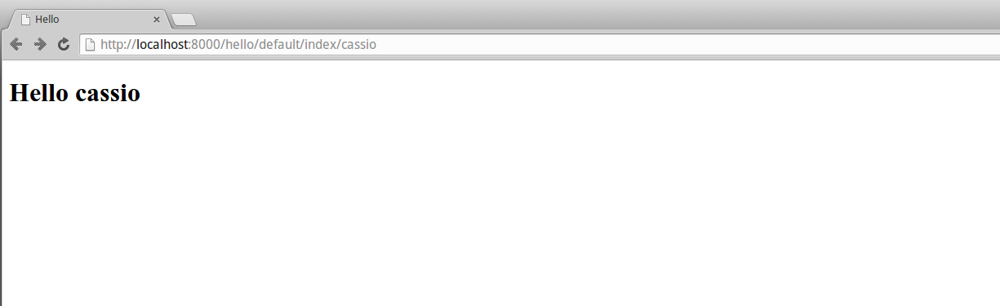

Title: Mais um passo com web2py
Date: 2015-07-07 00:00  
Category: web2py
Tags: web2py, iniciantes
Slug: mais-um-passo-com-web2py 
Author: Cássio Botaro  
Summary: Após escrever o hello world, é hora de dar mais alguns passos com web2py.


##Recapitulando

No [post](http://cassiobotaro.github.io/introducao-ao-web2py.html) anterior dei uma introdução sobre o que é o web2py e iniciamos a construção de uma aplicação, porém não através de um scaffolding(uma aplicação base).

Escrevemos um hello world personalizado onde o nome passado por argumento era retornado no corpo do retorno da nossa aplicação.



##O próximo passo

Ainda sem uma aplicação bem definida decidi aboradar um pouco da criação de um modelo e sua aplicação.

Este será então o nosso segundo hello world, criaremos um modelo, faremos sua exposição através da view e seu controle através de um controlador. Será dado uma pincelada como ter visões alternativas sobre o mesmo controlador.


## Definindo o modelo
Crie um arquivo dentro do diretório models chamado db.py com o seguinte conteúdo:
```python
db = DAL('sqlite://storage.sqlite', check_reserved=['all'])

db.define_table(
    'marcas',
    Field('nome')
)

db.define_table(
    'carros',
    Field('modelo', notnull=True),
    Field('ano', notnull=True),
    Field('marca', 'reference marcas'),
)
```
 
Agora temos definidos dois modelos de nossa aplicação, lembrando que estes modelos serão aplicados à [visão](http://web2py.com/books/default/chapter/29/07/forms-and-validators#SQLFORM) e a persistência de dados.

O que acabamos de definir é que utilizaremos o sqlite como banco de dados, e neste banco de dados temos duas tabelas onde serão armazenados nossos dados.

Em uma delas temos uma lista de marcas, e em outra uma lista de carros asosociados a estas marcas. todo carro deve possuir obrigatoriamente modelo, ano e marca.

##Populando nossas tabelas

Ainda no arquivo db.py adicione as seguintes linhas:
```python
# verifica se a tabela de marcas está vazia
if db(db.marcas).count() == 0:
    db.marcas.insert(nome='Fiat')
    db.marcas.insert(nome='Ford')
    db.marcas.insert(nome='Chevrolet')
    db.commit()

# verifica se a tabela de carros está vazia
if db(db.carros).count() == 0:
    db.carros.insert(modelo='Idea', marca=1, ano='2003')
    db.carros.insert(modelo='Ka', marca=2, ano='2004')
    db.carros.insert(modelo='Celta', marca=3, ano='2005')
    db.commit()

```

Temos 3 carros de 3 marcas distintas. Preste atenção no if que foi adicionado antes da inserção do carro, ele previne que a cada requisição carros repetidos sejam adicionados à tabela.

Lembre-se tambem que essa maneira de povoar os dados é somente para desenvolvimento e teste e pode ser apagado após os registros serem adicionados ao banco de dados. Apagar estas linhas evita duas consultas desnecessárias ao banco de dados.

## Controlando o que será exibido

Vamos voltar ao nosso controlador, o arquivo default.py(hello/controllers/default.py)

Já vimos que o controlador recebe uma requisição, realiza processamento e retorna alguma resposta ao solicitante.
Vamos então apagar o conteúdo de index e reescreve-lo agora consultando os carros existentes em meu banco de dados.

O código será o seguinte:
```python
def index():
    # pode ser traduzido como select * from carros
    # ou seja, todos os carros na tabela
    carros = db(db.carros).select()
    # dicionário que define as variáveis presentes no ambiente 
    # durante renderização da template html
    return {'carros': carros}
```

Com essa alteração nossa visão também deve ser alterada. Para uma vizualização interessante vamos fazer uma tabela.
Edite o arquivo index.html(hello/views/default/index.html)

```html
<!DOCTYPE html>
<html lang="pt-br">

<head>
    <meta charset="UTF-8">
    <title>Carros</title>
</head>

<body>
    <table class="table">
        <tr>
            <th>Modelo</th>
            <th>Marca</th>
            <th>Ano</th>
        </tr>
        {{for carro in carros:}}
        <tr>
            <td>{{=carro.modelo}}</td>
            <td>{{=carro.marca.nome}}</td>
            <td>{{=carro.ano}}</td>
        </tr>
        {{pass}}
    </table>
</body>
</html>

```

Um único detalhe que chamo atenção neste codigo é `{{carro.modelo.nome}}`, como as tabelas possuem relação o web2py irá ficar responsável por  buscar o nome do modelo de cada carro.
Visualize através da url: [http://localhost:8000/hello/default/index.json](http://localhost:8000/hello/default/index.json)

## Exibindo os mesmos dados de forma diferente

Já que temos uma resposta html, o quão será difícil retornar um json
com estes mesmos dados para uma possível comunicação entre sistemas ou at´e mesmo para consumo de um aplicativo móvel?

Na verdade é extremamente simples. Apenas crie no mesmo diretório onde se encontra a view index.html um arquivo index.json com o seguinte conteúdo.

```html
{{from gluon.serializers import json}}{{=XML(json(response._vars))}}
```

Para consultar visite a url: [http://localhost:8000/hello/default/index.json](http://localhost:8000/hello/default/index.json)

## Em breve tem mais...

Ficou curioso sobre o esquema de templates do web2py?, mais detalhes sobre os modelos? Ainda um pouco perdido? Não se preocupe.
Pretendo em breve escreves posts mais detalhados sobre cada aspecto do web2py como modelo, visão, controlador, modulos e também tratar brechas que até agora foram deixadas.

Curtiu? Compartilhe!

[ ]'s


