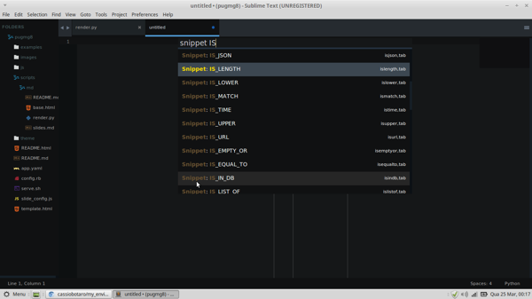
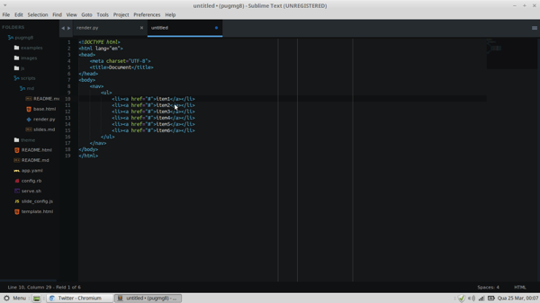

Title: Meu ambiente de trabalho
Date: 2015-03-25 03:00  
Category: Sublime  
Tags: python, sublimetext, iniciantes 
Slug: meu-ambiente 
Author: Cássio Botaro  
Summary: Apresentação do meu ambiente de trabalho para programação em Python(e web).

##Frustração
Sempre fui perfeccionista com meu editor de texto, já tentei várias ide's, mas sempre ficava faltando algum recurso que eu queria ou era pesada pra carregar e lenta na execução.
Spyder era legal, seu debugger é um dos melhores, o pydev era pesado, mas também interessante, Ninja IDE me atendeu por um tempo mais ainda assim não totalmente. Pycharm, gedit(até escrevi plugin para ele) e mais uma infinidade de editores.
Sempre tinha um recurso que faltava e eu não conseguia me decidir.
Foi ai que comecei com vim, utilizei por um tempo, mas eu gastava muito tempo configurando para torna-lo da maneira que eu gostava.
Nesta época comecei a escrever scripts para automatzar os processos.

##Solução
Sempre digo a todos, o melhor editor é aquele ao qual você mais se adapta e  se torna produtivo. O Sublime Text foi o que mais me identifiquei, logo aprendi os seus atalhos e adotei como editor padrao.
Mas ainda faltava os vários recursos que outros editores me forneciam.
Com a necessidade de preparar um abiente para programação python e personalizar o editor de texto, surgiu o [my_enviroment](https://github.com/cassiobotaro/my_environment).

##Meu Ambiente

Abaixo alguns recursos da minha configuração.

### ATENÇÂO: O script foi desenvolvido e testado em Ubuntu e linux Mint

##Isolamento de ambientes virtuais utilizando virtualenvwrapper

##Ipython 
### Terminal interativo com esteroides ###

##Complete para Django e Web2py
### Auto completar para web2py e django, vários snippets ###

##Um pouco de JS
### Auto completar e formatação ###

# Integração com git
### Comandos como push, pull, diff, status, etc, além do gutter que indica onde os arquivos foram modificados###

##REPL
### Terminal interativo para python, bash e outros. Sem contar a opção de debug.###

##Emmet
### Facilitando algum front-end ###

##E muito mais

Curtiu? Dê uma estrelinha pro projeto e faça seu fork e suas próprias configurações.

