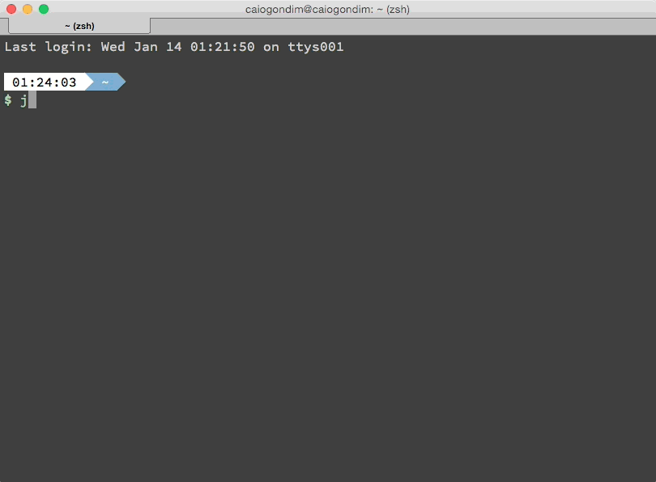

Title: mv /bin/bash /bin/zsh 
Date: 2015-08-09 01:00  
Category: Linux  
Tags: linux, dotfiles, iniciantes 
Slug: mv-bash-zsh  
Author: Cássio Botaro  
Summary: Why I changed from bash to zsh and how I made my new config.


##Motivation

A while ago, when I spoke at Santa Rita in Inatel, my laptop doesn't work with the projector. Then I had to use a friend's Mac with zsh. I love what I saw and decided that some day I'd give a chance to that shell.

Two months later i wrote my own .bashrc with some shortcuts to improve my productivity.

The result was [https://github.com/cassiobotaro/dot_files](https://github.com/cassiobotaro/dot_files).

Then, yesterday, I did a fresh xubuntu install and finally gave a chance to zsh, and I in love.


##Disclaimer
Works on Ubuntu with any interface, and works too in all *unix system, only changing the instalation commands.

If you have a question, look the references at the end of post. 


##Step by step

First install zsh. As I said, xubuntu is my distro, then I only have to write:
```bash
>>> sudo apt-get install zsh
```
As pre requisite git is needed, please install typing:
```bash
>>> sudo apt-get install git
```

After we have to install oh-my-zsh 
```
>>> sh -c "$(wget https://raw.github.com/robbyrussell/oh-my-zsh/master/tools/install.sh -O -)"
```
Oh my zsh is a great helper to manage zsh configuration. 

##Powerline fonts

To improve our experience, with fancy symbols and more, install powerline fonts and chage your terminal font with one of powerlined fonts.
Clone [this](https://github.com/powerline/fonts) repo and only type `./install`.

##Theme - bullet-train-oh-my-zsh-theme
My chosen theme is from a brazilian guy named Caio Gondim, and is amazing.
One pre requisite is powerline font.



Step by step:
```bash
>>> wget https://raw.githubusercontent.com/caiogondim/bullet-train-oh-my-zsh-theme/master/bullet-train.zsh-theme
>>> mv bullet-train.zsh-theme ~/.oh-my-zsh/themes/
# Configure the theme in your ~/.zshrc file
# ZSH_THEME="bullet-train"
```

## My own config

My changes at default values are:

In .zshrc

    ZSH_THEME="bullet-train"

    plugins=(git python extract django virtualenvwrapper ubuntu vagrant)

## Conclusion

One more thing is necessary, change my default shell.

```bash
>>> chsh -s $(which zsh)
```

Logoff and then logon, now zsh is your new default.

##Repositories

More information here:

[Oh-my-zsh](https://github.com/robbyrussell/oh-my-zsh)

[Powerline fonts](https://github.com/powerline/fonts)

[Bullet-train-oh-my-zsh-theme](https://github.com/caiogondim/bullet-train-oh-my-zsh-theme)

[old bashrc config](https://github.com/cassiobotaro/dot_files)


