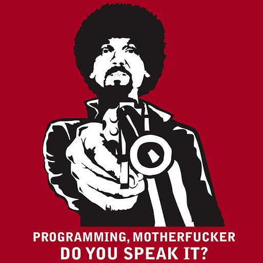

Title: Argumentos somente por palavra chave
Date: 2015-03-28 19:00  
Category: Python3  
Tags: python3
Slug: argumentos-somente-por-palavra-chave 
Author: Cássio Botaro  
Summary: Como um novo recurso do python 3 te ajuda a não brincar de roleta russa com seus parâmetros.

##Por que falar sobre isto?

Python 3 ainda possui uma névoa sobre ele, e o movimento de resistência ainda é grande. Mas isto não quer dizer que desbravadores já não o estejam explorando. Já escrevi um [post](http://cassiobotaro.github.io/porque-python-3.html) sobre a nova versão da linguagem, porém ainda tem vários recursos que podem ser demonstrados. Um deles é a capacidade de aceitar somente palavras chaves como argumento. Eu até coloquei isto nos slides da Python Brasil 10, porém senti que ao apresentar faltou uma boa explicação.

##Talk is cheap. Show me the code

Tentarei dar um exemplo utilizando código, explicarei utilizando os comentários

```python

# vamos iniciar com a seguinte função

def funcao(arg1, arg2, kill=False):
    if kill:
        shutil.rmtree('/')
    else:
        # realiza operacao
    ...

# e por algum algum descuido...
funcao(1,2,3)
# o que acontece?
# possivelmente você acaba de ser demitido

# Agora vamos corrigir isto utilizando python3
# lembre-se que daqui pra baixo, a sintáxe não é compativel com python 2

def funcao(arg1, arg2, *, kill=False):
    if kill:
        shutil.rmtree('/')
    else:
        # realiza operacao
    ...

# Basta colocar um * e pronto
# agora se cometer um erro o python 3 te alerta
funcao(1,2,3)
# TypeError: funcao() takes 2 positional arguments but 3 were given

# Mas o que é esse asterico, é igual o args?
# Na verdade é similar, porém o interpretador sabe que se não foi definido o 
# "args" um erro deve ser lançado

#Mas e se eu definir o args?
def funcao(arg1, arg2, *args, kill=False):
    if kill:
        shutil.rmtree('/')
    else:
        # realiza operacao
    ...

# acontece que agora, todo parâmetro passado além dos dois obrigatórios(positionals), será armazenado em args, e kill só sera atribuido quando
# utilizado palavra chave
#Ex: funcao(0, 0, kill=True)

```


## Considerações finais
Não pense que exemplo é exagerado, pode acontecer a qualquer hora com você.
Não brinque mais de roleta russa com seus argumentos.



